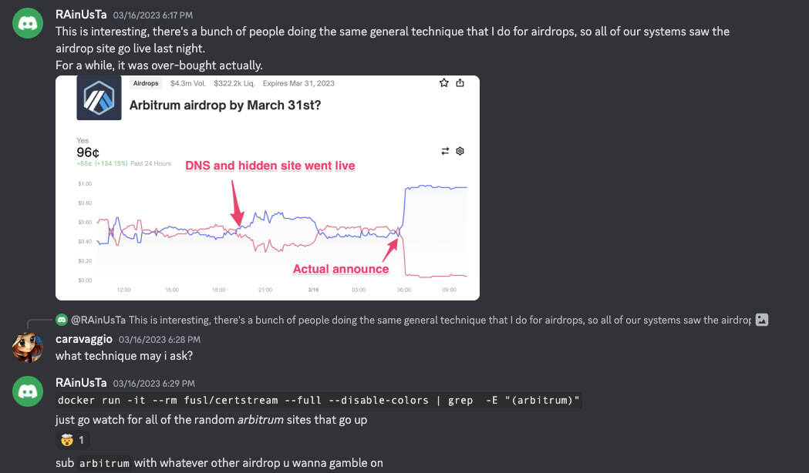

# airdroid •

**Discover airdrops before the masses.**

## What is airdroid?

_Airdroid_ is a tool that listens for new SSL certificates via CertStream websocket, and then checks if the domain names registered in the certificate are included in a list of specific keywords. If so, it will send a notification to a Telegram channel.

## Why?

Official airdrops always come with a website page, which often has a new domain or subdomain. This tool will help you discover airdrops before teams announce them officially.

## How does it work?

The primary flow is composed of three operations that are run concurrently:

1. A CertStream websocket connection is opened to listen for new certificates. Each certificate is checked against a whitelist of tracked keywords, and the resulting domains are added to a "new domains" list.
2. A thread is spawned to handle Telegram updates, periodically checking for new domains in the "new domains" list. If any are found, they are checked against the "already-known domains" list to avoid duplicates, and then returned as a Telegram message.
3. The Teloxide dispatcher is run to handle incoming commands to manage the bot.

Airdroid also uses RocksDB to store the domains list and some Telegram-related data. A DB instance is opened at startup and shared through all the components of the bot.

## How to use

To run airdroid, you need the Rust toolchain installed. You can install it by following the instructions [here](https://www.rust-lang.org/tools/install). Then, you can run the bot by following these steps:

1. Clone the repository and `cd` into it:

   ```shell
   git clone git@github.com:merklefruit/airdroid.git
   cd airdroid
   ```

2. Create a `.env` file and fill it with the env variables required:

   ```shell
   cp .env.example .env
   ```

3. Run the bot:

   ```shell
   cargo run
   ```

4. Once installed, you can open the telegram chat with the bot and should be able to send the `/help` command to see all the available commands.

## Acknowledgements

- [CertStream websocket](https://certstream.calidog.io/)
- [CertStream-Rust](https://github.com/hrbrmstr/certstream-rust)

Lastly, thanks to _Rain_ from the Flashbots discord for the idea!


